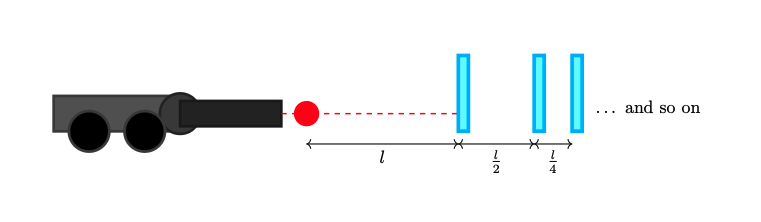

A couple of days ago, I found my old physics books and decided to remember the good ol' days and while doing so, I found a problem I propose for the Salvadoran Physics Olympiad and wanted to share the solution. I will try my best to properly translate it to English.

## Problem

In outer space, where gravity can be discarded, Bobby takes the cannon that Nacho gave him as a birthday present. There he sees a glass sheet at a distance $l$. Behind the first glass sheet, there is an infinite number of glass sheet and the distance between them, gets reduced by 2 as seen in the image below.

Bobby ignites the cannon and the ball hits the glass sheet. The glass sheet breaks and bounces back from the cannon. Assume that throughout this process, no energy is loss, momentum is conserved and the mass of the glass sheet is insignificant compared to the ball. This process continues until it breaks $n$ glass sheets. Bobby asks himself:

1. What is the position of the ball when it reaches the $n^{\text{th}}$ sheet.
2. What is the distance of the ball has traveled when it reaches the $n^{\text{th}}$ sheet.
3. Time taken to reach the $n^{\text{th}}$ sheet. Assume an initial velocity of $v$.

## Solution
### First problem

Let's assume that the when the ball hits the first glass sheet, it's in position $(0, l)$. Thus, $p_1 = (0, l)$. If we extrapolate this behavior we can see that:

$$p_2 = \left( 0, l + \frac{l}{2} \right)$$
$$p_3 = \left( 0, l + \frac{l}{2} + \frac{l}{4} \right)$$
$$p_4 = \left( 0, l + \frac{l}{2} + \frac{l}{4} +  \frac{l}{8}\right)$$
$$\dots$$

We see that this is just a geometric series, and thus, we can generalize this to:

$$
p_n = \left( 0, \sum_{k=0}^{n-1}l \left( \frac{1}{2}\right)^k \right) = \left( 0, l\frac{1 - \bigl(\tfrac12\bigr)^{n}}{1 - \tfrac12} \right) = \left( 0, 2l\Bigl(1 - \frac{1}{2^{n}}\Bigr) \right),
\qquad n\ge1.
$$

### Second problem
This one is very similar to first part, with the difference that the distances keep adding up. The ball is first launched and it travels a distance $l$ towards the first glass sheet and another $l$ back to the cannon. Then, it goes back to git the second glass sheet and it travels an extra distance $l + l/2$, and the overall distance would $l + l + l + l/2 = 3l + l/2$. If we keep this process, a very interesting pattern appears:

$$
d_n = d_{n-1} + 2d_{n-1} + \frac{\ell}{2^{n-1}} = 3d_{n-1} + \frac{\ell}{2^{n-1}},
\qquad d_1 = \ell.
$$

It doesn't long to solve and the final result I got was:

$$
d_n = \frac{2l}{5} \left( 3^n - \frac{1}{2^n} \right)
$$

Just a quick sanity check:
$$
d_1 = \frac{2l}{5} \left( 3^1 - \frac{1}{2^1} \right) = \frac{2l}{5} \left(3 - 0.5\right) = \frac{2l}{5} \cdot 2.5 = l
$$

$$
d_2 = 3d_1 + \frac{l}{2^{2-1}} = 3l + \frac{l}{2} = \frac{7l}{2}, \quad \text{and} \quad \frac{2l}{5} \left(3^2 - \frac{1}{2^2}\right) = \frac{2l}{5} \left(9 - 0.25\right) = \frac{7l}{2}
$$

### Third problem
Given the distance found in problem 2, we can find the time taken to reach the $n^{\text{th}}$ sheet by dividing distance over velocity. We can do this because we assumed that no energy was lost during collisions and the velocity remains the same. Thus:

$$
t_n = \frac{2l}{5v} \left( 3^n - \frac{1}{2^n} \right)
$$

And just for the heck of it, how about now we assume that the collisions are not longer elastic and after each collision, the velocity is reduced $\eta$ times. If you send me the solution for this problem, 삼겹살 is on me.